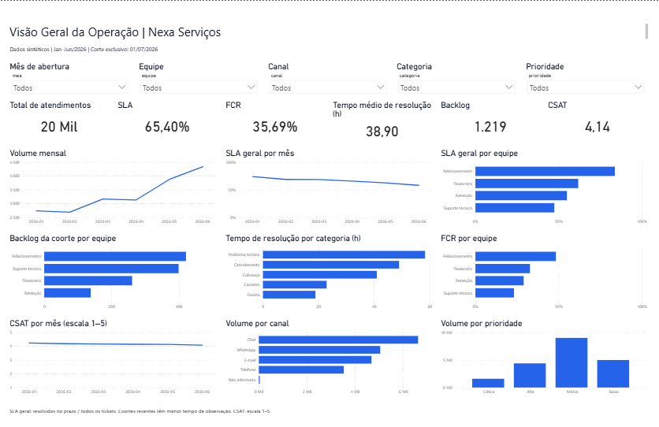

# Operational KPI Analytics

**Análise de Performance Operacional** — projeto de portfólio para estágio em Dados.

## Sobre o projeto

A empresa fictícia **Nexa Serviços** atende clientes por Chat, E-mail, Telefone e WhatsApp. Os gestores precisam entender demanda, prazos, pendências e satisfação para decidir onde investigar gargalos. Este projeto transforma tickets em indicadores explicáveis, consultas SQL e dados preparados para um dashboard gerencial no Power BI.

**Todos os dados são sintéticos.** Não representam pessoas, empresas ou resultados reais. As recomendações são exercícios de análise, não evidência de desempenho de uma operação real.

## Problema de negócio

A gestão recebe muitos registros de atendimento, mas não possui uma visão consistente da operação. Precisa saber se acompanha a demanda, quais equipes acumulam pendências e onde os clientes enfrentam mais demora. A unidade de análise é um ticket, identificado por `id_atendimento`.

## Objetivos

- Organizar e validar dados de atendimento com Python e Pandas.
- Construir oito KPIs com populações e limitações explícitas.
- Consultar indicadores com SQL e conferir seus resultados em Python.
- Analisar evolução temporal e diferenças por equipe, atendente, canal, categoria e prioridade.
- Preparar dados, medidas DAX e instruções para construir um dashboard profissional.

## Dataset

A execução padrão gera **20.000 tickets originais e 120 cópias exatas**, de janeiro a junho de 2026, com semente 42. O corte exclusivo é **01/07/2026 às 00:00**: só observamos acontecimentos anteriores a esse instante. As datas são horários locais de São Paulo, sem conversão de fuso. É uma base fechada para estudo, independente do dia em que o projeto é executado.

O gerador aumenta a demanda ao longo dos meses, reduz aberturas aos fins de semana e utiliza tempos assimétricos. Categorias técnicas tendem a demorar mais e prioridades críticas recebem tempos menores. Essas relações são escolhas da simulação; não são descobertas sobre uma empresa real.

Inclui canais nulos, categorias com grafia inconsistente, cópias, aberturas ausentes, fechamentos anteriores à abertura, notas fora da escala, interações negativas e respostas extremas. O CSV bruto é preservado; `rejeitados.csv` informa os motivos da quarentena e `qualidade.json` registra a reconciliação entre entrada e saída.

### Tratamento e validação

1. Conferir as colunas obrigatórias, tipos e nulos.
2. Remover somente cópias exatas. IDs com versões conflitantes vão integralmente para quarentena.
3. Converter datas e números; padronizar domínios sem confundir acentos ou espaços.
4. Rejeitar falhas críticas de identificação, datas, categoria, equipe ou status.
5. Preservar canal ausente como `Não informado`; não inventar notas, tempos ou interações.
6. Anular notas fora de 1–5, respostas negativas e contagens de interação inválidas.
7. Recalcular resolução pelas datas, SLA pela prioridade e FCR pelas interações.
8. Manter extremos plausíveis com marcação para investigação.

A regra de reconciliação é: **linhas brutas = duplicados removidos + rejeitados + tratados**. Os nulos de fechamento, SLA e FCR de tickets pendentes são esperados. FCR desconhecido em ticket resolvido continua no denominador solicitado e não entra no numerador: acompanhe a cobertura para entender o possível viés conservador.

Veja o [dicionário de dados](docs/dicionario_dados.md) para unidades, domínios e campos derivados.

## KPIs

Os indicadores padrão são da **coorte de tickets abertos no período**, observados até o corte. Resoluções mensais de produção usam a data de fechamento; estoque histórico usa a posição ao fim do mês. Não confunda essas três leituras.

| KPI | Fórmula | Pergunta de negócio |
| --- | --- | --- |
| Volume | Contagem de tickets válidos | Qual a demanda? |
| Tempo médio de resolução | Soma das horas de resolução / tickets resolvidos com tempo válido | Quanto tempo leva para resolver? |
| SLA geral | Resolvidos dentro do prazo / todos os tickets × 100 | Qual parcela da demanda foi resolvida no prazo? |
| FCR | Resolvidos com uma interação / tickets resolvidos × 100 | Quantos foram resolvidos no primeiro contato? |
| Backlog no corte | Tickets ainda abertos ou em andamento | Quantas solicitações faltam tratar? |
| CSAT médio | Soma das notas válidas / avaliações válidas de resolvidos | Como os respondentes avaliam o atendimento? |
| Produtividade | Quantidade de tickets resolvidos por equipe ou atendente | Qual a produção observada? |
| Taxa de resolução | Tickets resolvidos / todos os tickets × 100 | Quanto da demanda está resolvida? |

**SLA em horas corridas:** Crítica = 8 h, Alta = 24 h, Média = 48 h e Baixa = 72 h. O limite é inclusivo. Não se descontam noites, fins de semana ou feriados. O SLA geral segue a fórmula solicitada e inclui pendentes no denominador; também exportamos **SLA dos resolvidos**, com denominador restrito aos resolvidos, e pendentes vencidos.

**FCR** é uma aproximação: ticket resolvido com `quantidade_interacoes = 1`. Não há histórico de reabertura ou contatos independentes para confirmar resolução duradoura. **CSAT** usa escala 1–5 e média, não o percentual de notas 4–5. Exportamos quantidade de avaliações e cobertura entre resolvidos.

Sem população elegível, médias e percentuais são nulos; contagens são zero. Percentuais Python/SQL vão de 0 a 100; medidas DAX retornam frações formatadas como percentual.

**Produtividade não equivale a eficiência.** Não há horas trabalhadas, ausências ou dificuldade de cada ticket. O SQL adicional divide a produção pelos atendentes planejados da equipe (8, 10, 6 e 5), como aproximação descritiva, sem afirmar que houve trabalho igual. Não use ranking absoluto para premiar ou punir equipes.

**Atenção às coortes recentes:** junho teve menos tempo para resolver chamados. Comparar sua taxa de resolução com janeiro mistura desempenho e tempo de observação. O backlog histórico também só inclui tickets desta base, sem estoque anterior a janeiro ou migrações de equipe.

## Arquitetura

```text
Gerador sintético → CSV bruto → Pandas: validação e tratamento
                                      ↓
                     CSV tratado + auditoria + quarentena
                                      ↓
                            SQLite → consultas SQL
                                      ↓
                      KPIs + análises + insights → Power BI
```

Funções simples separam geração, ingestão, limpeza, indicadores, persistência e análise. A execução completa valida a equivalência dos KPIs gerais, das seis dimensões e do backlog mensal entre Python e SQL. Os testes utilizam resultados pequenos calculados manualmente.

## Tecnologias

- **Python:** execução e organização das regras de negócio.
- **Pandas e NumPy:** tratamento tabular e geração reproduzível dos dados.
- **SQLite e SQL:** banco local sem servidor e consultas analíticas legíveis.
- **unittest:** testes sem dependências adicionais.
- **Power BI e DAX:** documentação de modelo, medidas, filtros e visuais.
- **Git:** histórico de etapas reais, com mensagens em português.

**PySpark não foi utilizado:** 20 mil tickets cabem em memória e Pandas atende ao problema com menos configuração. PySpark seria uma possibilidade para volumes que justificassem processamento distribuído; acrescentá-lo aqui não contribuiria para a análise.

## Estrutura do projeto

```text
operational-kpi-analytics/
├── data/
│   ├── raw/atendimentos.csv
│   └── processed/              # Tickets, calendário, KPIs, quarentena e resultados SQL
├── src/
│   ├── config.py
│   ├── generation.py
│   ├── ingestion.py
│   ├── cleaning.py
│   ├── kpis.py
│   ├── database.py
│   └── analysis.py
├── sql/                       # KPIs gerais, seis dimensões, backlog, SLA e produção
├── powerbi/                   # Guia, medidas DAX e tema
├── docs/dicionario_dados.md
├── reports/                   # Insights e registro de validação
├── tests/                     # Indicadores, limpeza e estoque histórico
├── database/operational_kpis.db # Gerado localmente; ignorado pelo Git
├── main.py
├── requirements.txt
├── requirements-lock.txt
├── .gitignore
└── README.md
```

## Análises

`data/processed/kpis_por_*.csv` responde às perguntas por mês de abertura, equipe, atendente, canal, categoria e prioridade. `data/processed/sql/` contém os resultados de todas as consultas. `backlog_mensal.csv` reconstrói o estoque histórico e permite verificar:

**backlog final = backlog inicial + aberturas − resoluções**.

O estoque não é apenas a contagem de tickets atualmente pendentes agrupados pelo mês de abertura: um ticket encerrado em fevereiro ainda fazia parte do estoque ao fim de janeiro. Na análise mensal de produtividade, agrupamos por **mês de fechamento**.

Exemplo de consulta, usando Python para não depender de um executável SQLite:

```powershell
python -c "import sqlite3; c=sqlite3.connect('database/operational_kpis.db'); print(c.execute('SELECT equipe, COUNT(*) FROM atendimentos WHERE resolvido=0 GROUP BY equipe ORDER BY COUNT(*) DESC').fetchall()); c.close()"
```

## Dashboard

O [guia do dashboard](powerbi/dashboard.md) explica a página **Visão Geral da Operação**, seis cartões, nove gráficos obrigatórios, filtros, modelo e conferência. As [medidas DAX](powerbi/medidas.dax) e o [tema JSON](powerbi/tema.json) podem ser utilizados no Power BI Desktop.

O dashboard está disponível em [operational_kpis.pbix](powerbi/operational_kpis.pbix), com dados carregados, tema Nexa e as páginas **Visão Geral da Operação** e **Diagnóstico**. O [projeto PBIP](powerbi/operational_kpis.pbip) mantém o modelo e a definição dos visuais em arquivos editáveis. Consulte [como abrir o dashboard](powerbi/ABRIR_DASHBOARD.md).



*Captura real do relatório no Power BI Desktop, com dados sintéticos de janeiro a junho de 2026.*

Os seis KPIs gerais, o backlog histórico dos seis meses e um cenário com filtros combinados de mês, equipe e canal foram conferidos em DAX contra os resultados do projeto. Veja o [registro da validação no Power BI](reports/validacao_powerbi.md).

## Principais insights

Veja também o [registro de validação e os valores dos KPIs](reports/validacao.md).

Os resultados abaixo são substituídos automaticamente pela execução; não são números preenchidos manualmente.

<!-- INICIO_INSIGHTS -->

- Relacionamento apresenta o maior SLA geral: 83.70%.
- Relacionamento concentra o maior backlog na data de corte: 421 tickets.
- Problema técnico tem o maior tempo médio de resolução: 58.35 horas.
- Chat é o canal com maior demanda: 6621 tickets.
- Problema técnico concentra o maior volume por categoria: 6007 tickets.
- O pico de aberturas ocorre em 2026-06: 4332 tickets.
- Relacionamento apresenta o maior FCR: 48.28%.
- O CSAT da coorte de aberturas passou de 4.22 para 4.07 (escala 1–5).
- O backlog de fim de mês passou de 213 para 1219 tickets.
- SLA geral: variação de -16.01 pontos percentuais entre a primeira e a última coorte mensal.
- FCR: variação de -1.26 pontos percentuais entre a primeira e a última coorte mensal.
- taxa de resolução: variação de -7.58 pontos percentuais entre a primeira e a última coorte mensal.
- Tempo médio por prioridade: Crítica: 17.12 h; Alta: 28.85 h; Média: 39.94 h; Baixa: 52.91 h. A associação não demonstra causalidade.
- Relacionamento lidera a produção absoluta: 7475 resoluções. Equipes têm tamanhos e demandas diferentes.

<!-- FIM_INSIGHTS -->

### Como transformar os resultados em decisões

Investigue categorias com resolução demorada para propor uma base de conhecimento ou uma fila especializada. Use volume, backlog e pendentes vencidos para avaliar redistribuição de demanda. Acompanhe FCR junto ao CSAT e às coberturas: resolver em um contato não garante satisfação. Qualquer intervenção precisaria de dados operacionais reais, disponibilidade das equipes e acompanhamento posterior.

## Como executar

Requisito: **Python 3.11 ou superior**. Execute os comandos na pasta deste projeto.

### Windows — PowerShell

```powershell
python -m venv .venv
.\.venv\Scripts\python.exe -m pip install -r requirements-lock.txt
.\.venv\Scripts\python.exe main.py
.\.venv\Scripts\python.exe -m unittest discover -s tests -v
```

Os comandos usam diretamente o Python do ambiente virtual e não precisam alterar a política de execução do PowerShell.

### Linux e macOS

```bash
python3 -m venv .venv
.venv/bin/python -m pip install -r requirements-lock.txt
.venv/bin/python main.py
.venv/bin/python -m unittest discover -s tests -v
```

Para testar outra simulação:

```powershell
.\.venv\Scripts\python.exe main.py --quantidade 25000 --semente 7
```

A execução sobrescreve somente os artefatos gerados deste projeto, o banco local e a seção automática de insights. O limite aceito é de 10 mil a 30 mil tickets. `requirements.txt` descreve as faixas das dependências; `requirements-lock.txt` registra as versões usadas na validação. Para recuperar o cenário apresentado, execute com os padrões (20.000 e 42).

## Possíveis melhorias

- Incorporar histórico de reabertura, transferência de equipe e horários trabalhados.
- Modelar SLA em horas úteis quando essa for a regra contratual.
- Separar coortes com janela de observação equivalente e incluir estoque inicial.
- Medir representatividade das avaliações de satisfação.
- Publicar o relatório e ampliar a revisão de acessibilidade e dos cenários de filtros.

## Como explicar o projeto em uma entrevista

**Qual problema você resolveu?** Organizei uma base sintética de atendimento para responder perguntas de gestão sobre demanda, prazo, estoque e satisfação. O exercício mostra como transformar registros em indicadores com regras claras.

**Por que escolheu esses KPIs?** Volume descreve demanda; resolução e produtividade mostram produção; tempo e SLA acompanham prazo; backlog mostra trabalho acumulado; FCR e CSAT ajudam a avaliar a experiência do cliente.

**Como calculou o SLA?** Recalculei horas entre abertura e fechamento e comparei com o prazo da prioridade. O indicador principal divide resolvidos no prazo por todos os tickets. Apresentei também a versão entre resolvidos para esclarecer o efeito das pendências.

**O que é FCR?** É a resolução no primeiro contato. Nesta base, uso um ticket resolvido com uma interação como aproximação. Em uma operação real, verificaria reaberturas e contatos posteriores.

**Como garantiria que os indicadores estão corretos?** Usaria regras de elegibilidade explícitas, auditoria da limpeza, testes com resultados conhecidos e reconciliação entre Python e SQL. Depois conferiria os cartões do Power BI com as mesmas populações e filtros.

**Como o Power BI consome os dados?** Importa os CSVs tratados e o calendário. O relacionamento usa a data de abertura sem horário. As medidas respeitam os filtros de período, equipe, canal, categoria e prioridade. O backlog histórico usa datas para reconstruir o estoque.

**Que decisão poderia ser tomada?** Investigar a fila com maior estoque vencido, comparar demanda e disponibilidade e propor melhorias na categoria mais demorada. Não atribuiria culpa à equipe apenas por um ranking: tamanho, complexidade e tempo de observação também afetam os resultados.
